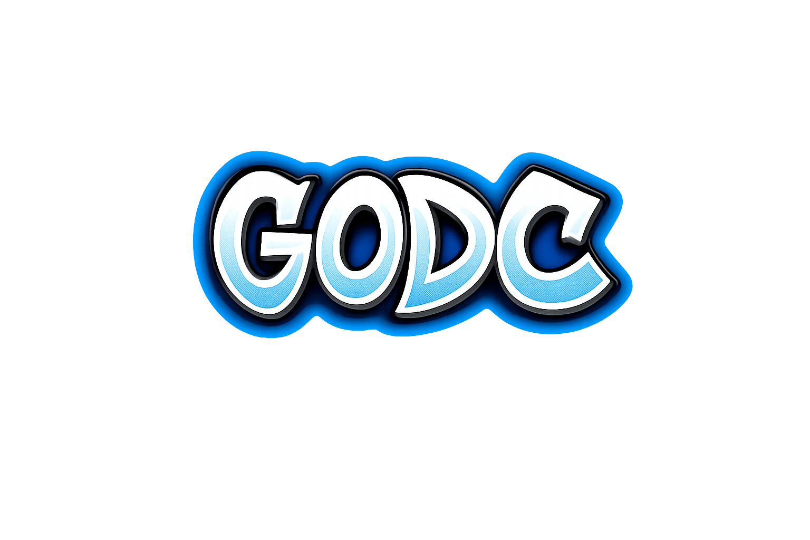

<p align="center">
  
</p>

# godc

CLI for building Go programs for Sega Dreamcast.
It uses [pre-built KOS](https://github.com/drpaneas/dreamcast-toolchain-builds) ready for coding.

## Install

```bash
go install github.com/drpaneas/godc@latest
```

## Setup

Download and install the Dreamcast toolchain:

```bash
godc setup  # Download and install the libraries
godc doctor # Check installation (optional)
godc env    # Show environment info (optional)
```

This installs to `~/dreamcast` and updates your shell config.

```shell
KallistiOS environment loaded:
  KOS_BASE:    $HOME/dreamcast/kos
  KOS_CC_BASE: $HOME/dreamcast/sh-elf
  KOS_PORTS:   $HOME/dreamcast/kos-ports
  GCC version: 15.1.0
```

## Usage

```bash
mkdir my_game; cd my_game # Create a directory to work
godc init     # Initialize it
vim main.go   # Write you code
godc build    # Build
godc run      # Run in emulator
godc run --ip # Run on hardware via dc-tool-ip
```

## Custom Configuration (optional)

```bash
godc config # Configure emulators, IP Addresses etc
```

Config file: `~/.config/godc/config.toml`

```toml
Path = "/home/user/dreamcast"
Emu = "flycast"
IP = "192.168.2.203"
```
